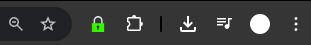
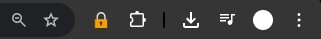
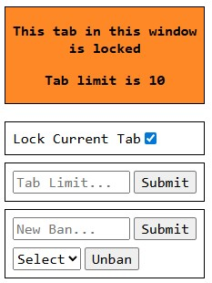
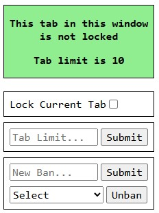

# [Lockin - Webstore](https://chromewebstore.google.com/detail/lockin/ekclemfcpeipfokbhiebmppdpecmapeh)

How the pinned extension looks with no tab lock  
  
How the pinned extension looks with a tab lock  
  
How the extension popup looks  

  

### Using Deployed Version
-   have a chromium based browser
- then, [download from webstore](https://chromewebstore.google.com/detail/lockin/ekclemfcpeipfokbhiebmppdpecmapeh)

### Running Locally
-   [node.js](https://nodejs.org/en/download)
-   have a chromium based browser
-   clone repo
-   `npm i` in root dir of repo
-   `npm run local-build` (compiles extn to vanilla html/css/js to `dist` folder which can be loaded in chrome)
-   load `dist` folder as unpacked extn in browser

### Code Structure

-   `types.ts` - state definitions and constants
-   `main.ts` - behaviour for popup page of extn
-   `util.ts` - util functions, mostly interacting with chrome apis
-   `service_worker.ts` - behaviour for background script of extn (enforcing restrictions)

### Notes
-   if modifying extn code locally, you may need to manually remove/re-add the extn, as opposed to merely clicking refresh btn, as clicking the refresh btn does not clear local storage